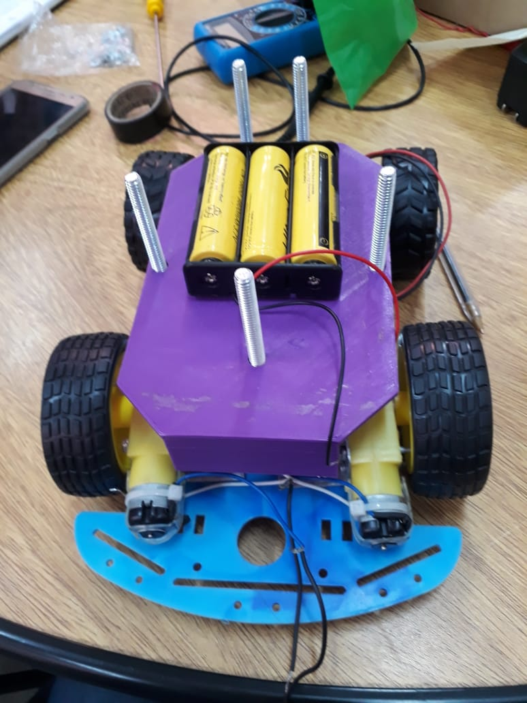
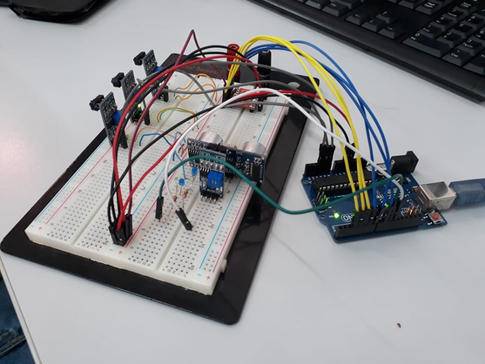

# Robô Segue Faixa 

Robô criado para a categoria de segue faixa  da OBR ( Olimpíada brasileira de robótica ), utilizando um arduino uno.

### Montagem mecanica

### Prototipação de circuito elétrico

